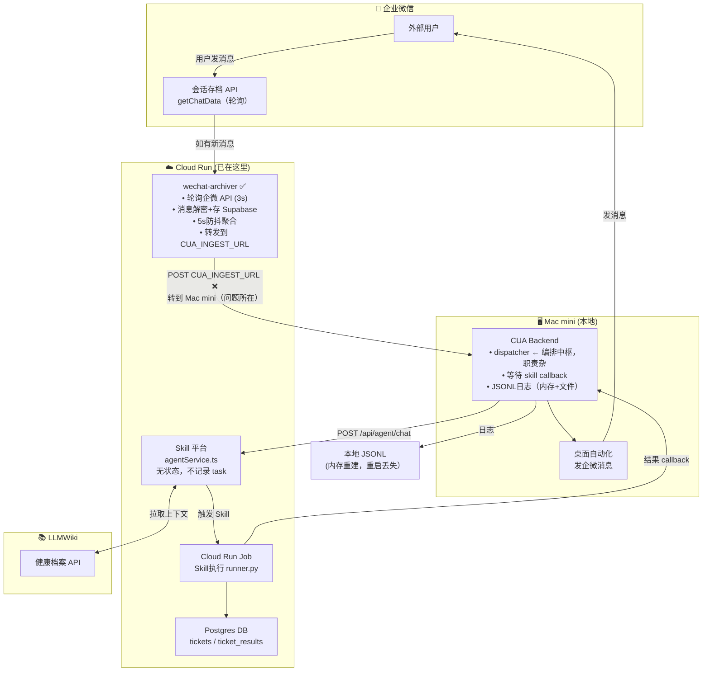
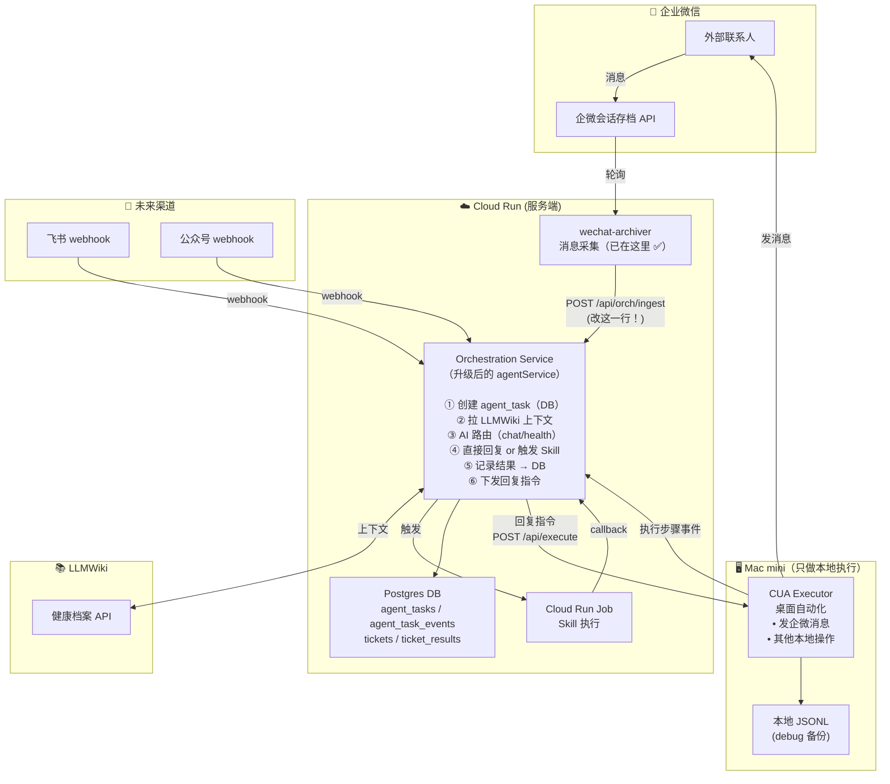

# 架构梳理：Agent 系统现状与目标

> **核心认知：** 企微消息「接收」已经在服务端（`wechat-archiver` 在 Cloud Run），不经过 Mac mini。  
> 现在的问题是它把消息转发给了 Mac mini，让 Mac mini 充当了不该属于它的编排中枢。

---

## 现状架构（真实组件）



---

## 现状问题诊断

### 真正的职责问题

| 职责 | 当前位置 | 应该在哪 |
|------|---------|----------|
| 企微消息接收（会话存档 API） | Cloud Run (wechat-archiver) ✅ | Cloud Run ✅ |
| **消息转发到 AI 处理** | 先到 Mac mini ❌ | **直接到 Server** |
| **任务编排/协调（dispatcher.py）** | Mac mini ❌ | **Server** |
| **结果等待 + 状态维护** | Mac mini ❌ | **Server DB** |
| 本地桌面自动化执行 | Mac mini ✅ | Mac mini（必须）|
| 发消息（CUA 操作企微 App）| Mac mini ✅ | Mac mini（暂时）|
| **日志维护（JSONL + 内存）** | Mac mini ❌ | **Server DB** |

### 核心矛盾

> `wechat-archiver` 已经在服务端拿到了消息，但它把消息转发给了 Mac mini，  
> 让 Mac mini 成为编排中枢，在服务端和本地之间制造了不必要的网络跳转和状态分裂。  
> 只需要把 `CUA_INGEST_URL` 改为指向 Skill 平台，Mac mini 就退化为纯粹的「执行器」。

## 目标架构

核心思想：**Server 是大脑，Mac mini 是手脚**



---

## 核心新概念：Orchestration Service

这不是一个新的独立服务，而是把 `agentService.ts` 升级成真正的**任务编排中枢**，加上持久化存储。

### 统一的 `agent_tasks` 表（服务端 Source of Truth）

```
agent_tasks
├── task_id          (全局唯一)
├── session_id       (用户会话，跨任务)
├── user_id          (用户唯一标识，跨渠道统一)
├── source_channel   ('wecom' | 'feishu' | 'mp' | 'ticket' | ...)
├── input_content    (原始消息)
├── route_type       ('chat' | 'health_direct' | 'health_skill')
├── skill_id         (如果用了 skill)
├── ticket_id        (关联工单，如果走了工单系统)
├── status           (pending → routing → executing → done/failed)
├── reply_content    (最终回复)
├── started_at / ended_at / duration_ms
└── events[]         (关联的详细事件流)

agent_task_events
├── task_id
├── event_type       ('message_received' | 'wiki_fetched' | 'route_decided' |
│                     'skill_started' | 'cua_step' | 'reply_sent' | ...)
├── payload          (JSON，各事件的具体数据)
└── ts
```

### Adapter 只需要做三件事

```
1. 监听渠道消息
   → POST /api/orch/ingest { source, user_id, content, ... }

2. 监听 Orchestration 的回调
   → 收到 delivery_instruction { task_id, content, channel_specific_params }
   → 执行发送（必要时调 CUA 执行引擎）

3. 执行期间，把步骤事件推回 Server（可选，用于日志）
   → POST /api/orch/task-events { task_id, event_type, payload }
```

---

## 日志统一效果

```
用户「张三」一次健康咨询的完整日志（全在 Server DB）:

agent_task: task_abc123
  source: wecom
  user_id: wecom_zhangsan
  input: "我最近血压有点高"

  events:
  ├─ [10:00:01] message_received   content="我最近血压有点高"
  ├─ [10:00:01] wiki_fetch_start   user_id=wecom_zhangsan
  ├─ [10:00:02] wiki_fetched       profile=120字 wiki=850字
  ├─ [10:00:03] route_decided      type=health → skill="血压管理分析"
  ├─ [10:00:03] reassurance_sent   "正在为您分析，请稍候..."
  ├─ [10:00:03] skill_started      skill_id=xxx job_id=yyy
  ├─ [10:00:04] cua_step           (如果需要 CUA) type=tool_call name=screenshot
  ├─ [10:00:35] skill_done         transcript=[35步 AI 执行过程]
  ├─ [10:00:35] reply_sent         recipient=张三 channel=wecom
  └─ [10:00:35] wiki_sync_triggered reason=skill_complete
```

**以后不管接入飞书还是公众号，日志格式完全一样，只是 `source` 字段不同。**

---

## 改动量与风险评估

### 方案：「最小改动切流」（推荐）

> **核心切换只有一行配置**：`wechat-archiver` 的 `CUA_INGEST_URL` 改为指向 Skill 平台新入口。

#### 改动点清单

| # | 改动 | 位置 | 改动量 | 风险 |
|---|------|------|--------|------|
| 1 | 加 `/api/orch/ingest` 入口（复用 agentService 逻辑）| Skill Platform | ~50 行 | 低 |
| 2 | 加 `agent_tasks` + `agent_task_events` 表 | DB migration | ~20 行 SQL | 低 |
| 3 | `agentService.ts` 每次处理写 task 记录 + 关键事件 | agentService.ts | ~100 行 | 中 |
| 4 | `wechat-archiver` 改 `CUA_INGEST_URL` 环境变量 | Cloud Run 配置 | 1 行配置 | 低 |
| 5 | `wechat-archiver` 的 `callback_url` 改指向 Skill 平台 | cua_forwarder.js | ~5 行 | 低 |
| 6 | Skill 平台报 callback 后调 CUA Executor HTTP 发消息 | agentService.ts | ~30 行 | 中 |
| 7 | 前端 Agent 日志页（展示 agent_tasks）| 前端 | ~200 行 | 低 |

**总计：~400 行有效代码改动，不涉及任何功能重写。**

#### 利弊分析

**优点：**
- ✅ `wechat-archiver` 不动（只改一个环境变量）
- ✅ CUA Executor 不动（Mac mini 还是原来的执行器）
- ✅ 所有日志从此集中在 Server DB，渠道无关
- ✅ 未来接入飞书/公众号只需加新 adapter，发同样的 `/api/orch/ingest`
- ✅ 可以做灰度：先让少量流量走新路径，确认没问题再全切
- ✅ CUA backend 可以逐步退场（旧功能迁移完后关掉）

**风险/缺点：**
- ⚠️ Mac mini → Server 的回复指令依赖网络（GCP → Mac mini Tailscale），需证明联通可靠
- ⚠️ `agentService.ts` 目前是无状态的，加状态需注意并发（同一用户同时两条消息）
- ⚠️ CUA Executor 暴露 HTTP 接口需认证（sandbox-secret 机制已有，可复用）
- ⚠️ 过渡期内旧流程并存，需幂等（`idempotency_key` 已有）

#### 发消息的特殊处理

目前企微发消息走 Mac mini CUA（桌面自动化）。未来如果企微支持直接发送客户消息的 API，可以完全去掉 Mac mini 这步。

#### 实施路径

```
第一步（1-2天）― 日志集中，风险最低
  Skill 平台加 agent_tasks 表 + /api/orch/ingest 入口
  agentService.ts 写 task 记录（不改流程）
  验证：旧流程消息 + 新入口消息都能在平台查到日志

第二步（2-3天）― 消息流切到服务端
  改 CUA_INGEST_URL → Skill 平台
  Skill 平台调 CUA Executor HTTP 接口发回复
  CUA backend 退化为纯 Executor（只听 HTTP）

第三步（按需）― 多渠道 + 统一日志页面
  前端新增 Agent 日志页（展示 agent_tasks、按渠道过滤）
  准备接入飞书等新渠道
```
